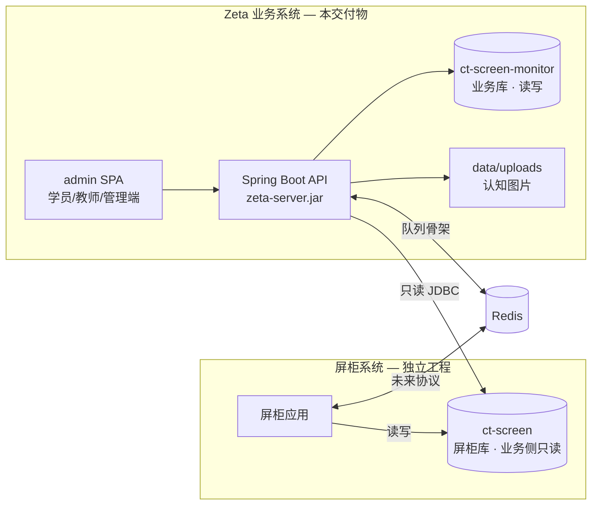
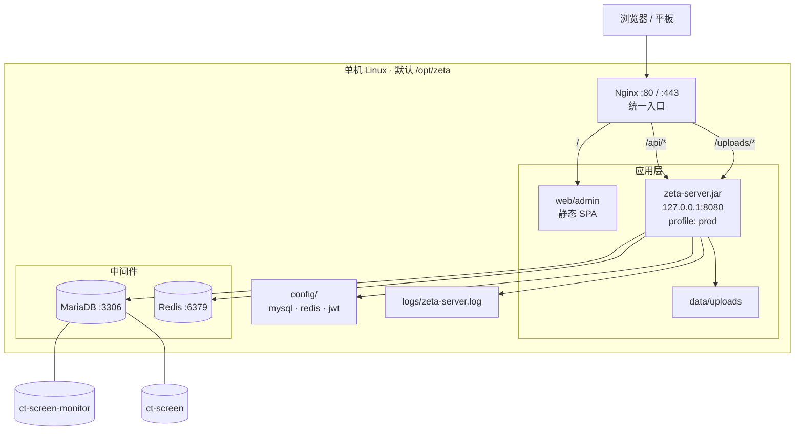
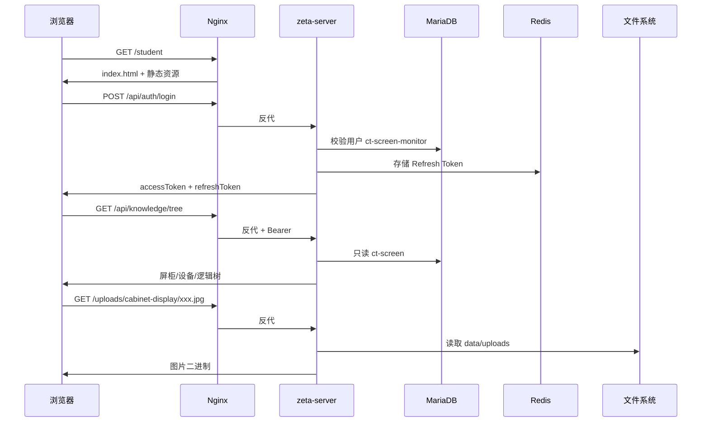
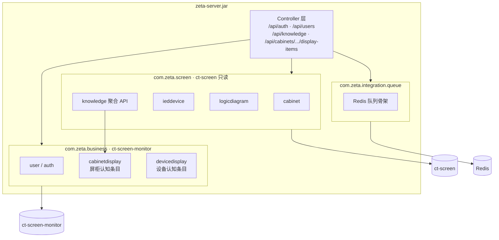
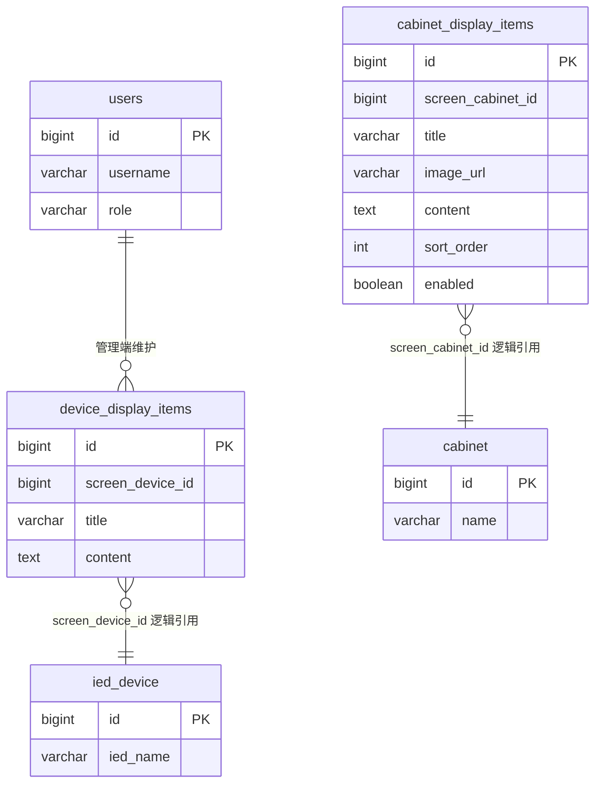

# Zeta 业务系统 — 架构说明

本文描述 Zeta **业务系统**在单机部署场景下的整体架构，涵盖与屏柜系统的边界、运行时组件、数据流与目录布局。

---

## 1. 系统定位

Zeta 业务系统面向学员 / 教师 / 管理员，提供教学流程、屏柜认知展示、保护逻辑浏览等上层能力。  
屏柜结构、IED 设备、逻辑框图等**硬件侧数据**由独立的**屏柜系统**维护；业务系统通过只读连接访问屏柜库，必要时经 Redis 队列异步交互。



| 系统 | 数据库 | 职责 |
|------|--------|------|
| **业务系统** | `ct-screen-monitor` | 用户、JWT、屏柜/设备认知条目、业务流程 |
| **屏柜系统** | `ct-screen` | 屏柜、IED、保护逻辑框图等 |
| **共享** | Redis | Refresh Token；屏柜 ↔ 业务消息队列（可选） |

---

## 2. 单机部署总览

生产环境推荐**一台 Linux 主机**承载全部运行时组件：Nginx 对外、Spring Boot 仅本机监听、MariaDB 与 Redis 本机部署。



**设计要点**

- 公网只暴露 Nginx；**8080 不对公网开放**（`application-prod.yml` 绑定 `127.0.0.1`）。
- 前端为构建后的静态资源，由 Nginx `try_files` 支持 SPA 路由。
- 认知图片落盘 `/opt/zeta/data/uploads`，URL 前缀 `/uploads/`。
- 敏感配置外置 `/opt/zeta/config/`，不打入交付 JAR。

---

## 3. 请求链路



| 路径 | 处理方 | 说明 |
|------|--------|------|
| `/` | Nginx → `web/admin` | React SPA |
| `/api/*` | Nginx → JAR | REST API、鉴权 |
| `/uploads/*` | Nginx → JAR | 认知图片静态映射 |

---

## 4. 后端逻辑分层



**模块职责**

| 包 | 库 | 说明 |
|----|-----|------|
| `business.*` | ct-screen-monitor | 用户、JWT、认知条目 CRUD、图片上传元数据 |
| `screen.*` | ct-screen（只读） | 屏柜 / 设备 / 保护逻辑查询 |
| `integration.queue.*` | Redis | 屏柜系统消息通道（默认关闭） |

---

## 5. 数据模型（业务库摘要）



> `cabinet` / `ied_device` 实体位于 **ct-screen**，跨库引用**无外键**；写入认知条目前后端只读校验屏柜库中记录是否存在。

---

## 6. 磁盘与进程

```mermaid
flowchart LR
  subgraph systemd [systemd]
    ZS[zeta-server.service\nUser=zeta\nWorkingDirectory=/opt/zeta]
  end

  subgraph opt [/opt/zeta]
    bin[bin/zeta-server.jar]
    web[web/admin/]
    cfg[config/*.yml]
    data[data/uploads/]
    log[logs/]
  end

  ZS --> bin
  bin -.读取.-> cfg
  bin -.写入.-> data
  bin -.写入.-> log
  Nginx[Nginx] -.读取.-> web
```

| 路径 | 内容 | 备份 |
|------|------|------|
| `/opt/zeta/bin/` | JAR | 升级时替换 |
| `/opt/zeta/web/admin/` | 前端静态 | 升级时替换 |
| `/opt/zeta/config/` | DB/Redis/JWT 配置 | **必须** |
| `/opt/zeta/data/uploads/` | 上传的认知图片 | **必须** |
| `/opt/zeta/logs/` | 应用日志 | 可选 |

---

## 7. 交付与安装关系

```mermaid
flowchart LR
  subgraph dev [开发/发布]
    Src[源码 code/]
    Build[build-release.sh]
    Dist[dist/zeta-version.tar.gz]
    Src --> Build --> Dist
  end

  subgraph ops [现场运维]
    Dist --> Install[install.sh]
    Install --> Opt[/opt/zeta]
    Opt --> Systemd[systemctl zeta-server]
    Opt --> NginxCfg[nginx zeta.conf]
  end

  subgraph upgrade [后续升级]
    Dist2[新版本 tar.gz]
    Dist2 --> Up[upgrade.sh]
    Up --> Opt
  end
```

交付包内含：**JAR**、**build 后的 admin**、**部署文档**（`README.md`）、**安装/升级脚本**、配置与 Nginx 示例。详见 [README.md](./README.md)。

---

## 8. 相关文档

| 文档 | 说明 |
|------|------|
| [deploy/README.md](./README.md) | 安装、升级、环境要求 |
| [code/README.md](../code/README.md) | 源码结构与开发启动 |
| [code/server/README.md](../code/server/README.md) | 后端 API 与配置分层 |
| [schema-monitor.sql](../schema-monitor.sql) | 业务库表结构 |
| [schema.sql](../schema.sql) | 屏柜库表结构 |
